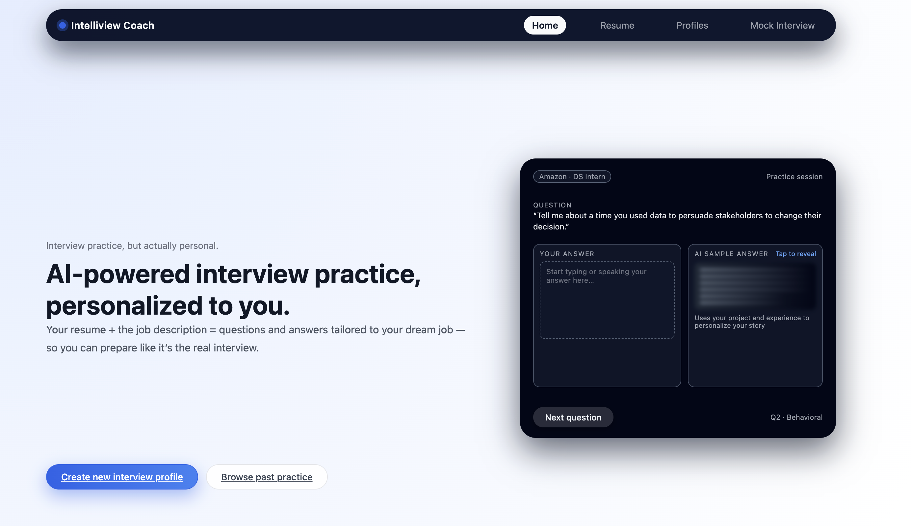
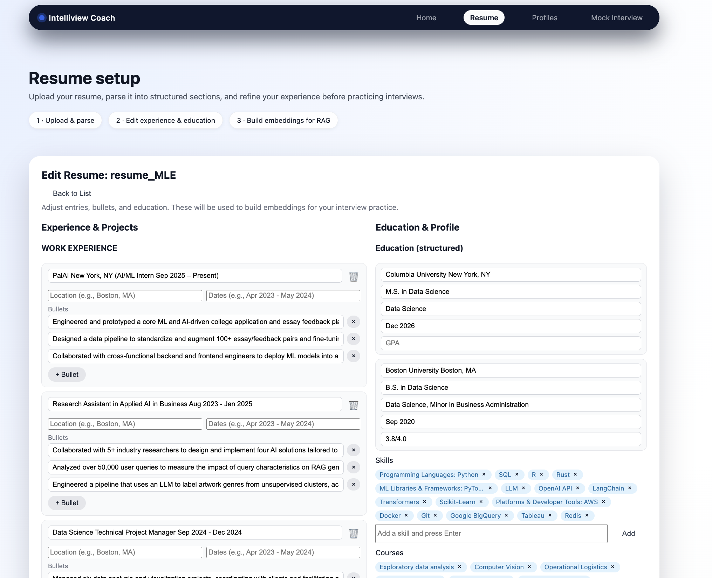
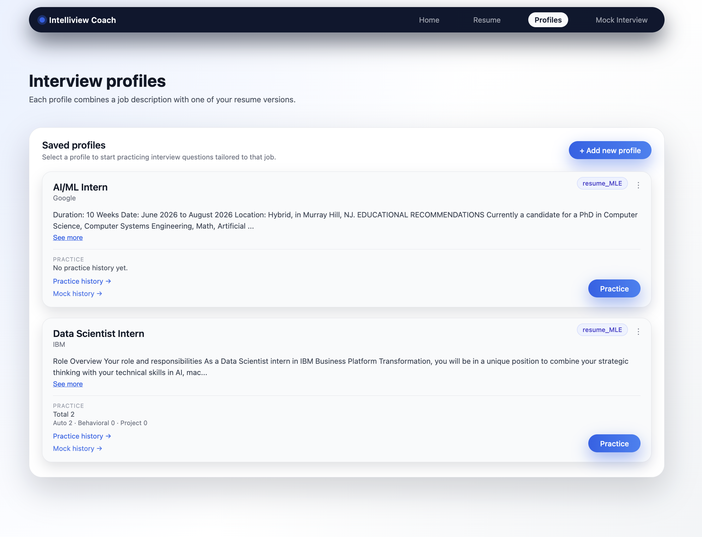
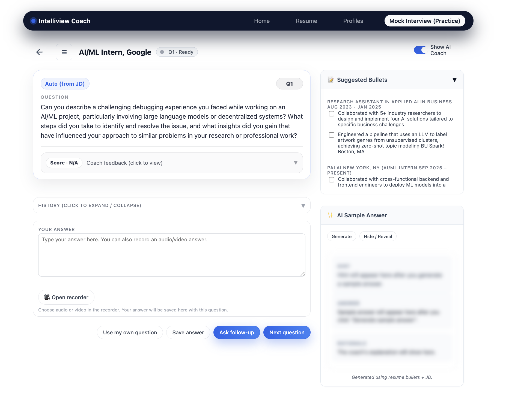
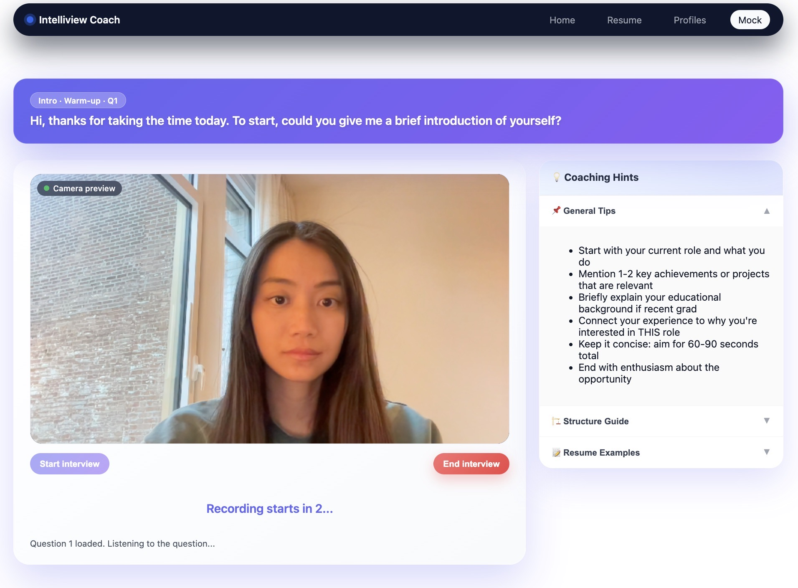
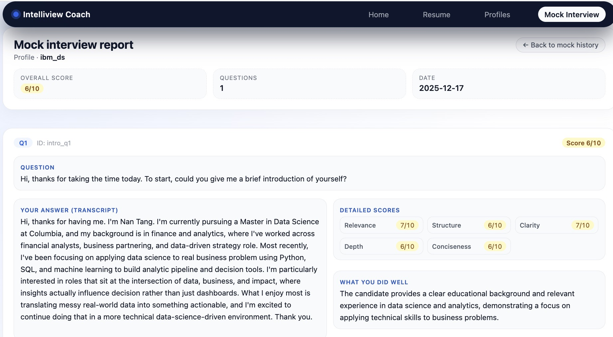
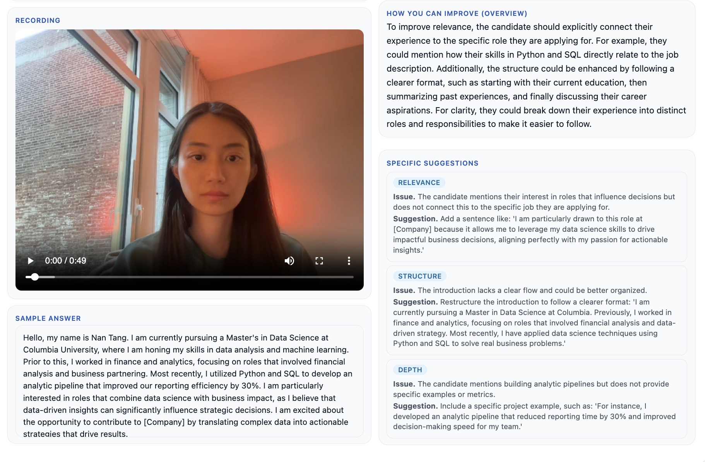

# Intelliview Coach

**An AI-Powered Interview Coaching System**

Intelliview Coach helps job seekers (DS/SWE/ML/AI Engineers) prepare for interviews by providing real-time, personalized feedback. It integrates **LLM-based question generation**, **RAG-based resume retrieval**, and **multimodal analysis** into a seamless interactive experience.

---

## 📸 Demo Showcase

### Home Page

*Landing page showcasing the AI-powered interview coaching experience*

### Resume Setup

*Upload and parse your resume into structured sections*

### Interview Profiles

*Manage multiple job profiles with different resumes and job descriptions*

### Practice Session

*Interactive practice with AI-generated questions tailored to your profile*

### Mock Interview

*Full mock interview experience with video recording*

## Mock Interview Report


*Real-time feedback with score and feedback on several aspects*

---

## 🚀 Key Features

- **📄 Resume Parsing**: Automatically extracts skills, experience, and education from PDF resumes.
- **🔍 Smart RAG Retrieval**: Uses a fine-tuned embedding model to retrieve the most relevant resume experiences for specific interview questions.
- **🤖 AI Interviewer**: Generates tailored technical and behavioral questions based on the Job Description (JD) and your profile.
- **🎙️ Multimodal Feedback**: Captures audio/video answers and provides detailed feedback on content, clarity, and relevance.
- **📊 Scoring & Insights**: Evaluates answers against the JD requirements and offers actionable improvement tips.

---

## ⚡ Quick Start Guide

### Prerequisites

- **Python 3.11 (Recommended)**
  - **Important**: `mediapipe` is NOT compatible with Python 3.13 or 3.14 yet.
  - While Python 3.9 works, we strongly recommend **Python 3.11** for best compatibility and syntax support.
  - If you are on macOS: `brew install python@3.11`.
- **Sox** (Required for audio processing)
  - macOS: `brew install sox`
  - Linux: `sudo apt-get install sox`
- **OpenAI API Key**: You need a valid OpenAI API key for LLM functionality.

### 1. Clone the Repository

```bash
git clone git@github.com:<your-username>/Intelliview-AML_project.git
cd Intelliview-AML_project
```

### 2. Set Up Virtual Environment

**macOS / Linux:**
```bash
# Install Python 3.11
brew install python@3.11

# Create venv using Python 3.11
/opt/homebrew/bin/python3.11 -m venv venv

# Activate it
source venv/bin/activate
```

**Windows:**
```bash
python -m venv venv
venv\Scripts\activate
```

### 3. Install Dependencies

```bash
pip install --upgrade pip
pip install -r requirements.txt
```

### 4. Configuration

Create a `.env` file in the root directory:

```bash
touch .env
```

Add your OpenAI API key to `.env`:
```
OPENAI_API_KEY=sk-your-api-key-here
```

### 5. Download Model Artifacts (CRITICAL)

The application requires fine-tuned models for the Retrieval-Augmented Generation (RAG) system. These are too large for Git and must be downloaded manually.

1. **Download** the model folder from [Google Drive](https://drive.google.com/drive/folders/1eJNOiU2VUq8HNC9VqckAJ3VPeIQDHU0b).
2. **Extract/Place** the downloaded contents so the structure looks exactly like this:

```
Intelliview-AML_project/
└── models/
    └── jdq_bullet_finetuned/
        ├── config.json
        ├── model.safetensors
        ├── tokenizer.json
        └── sentence_transformer_config.json
```

> **Note:** Without this folder structure, the application will fail to start or crash during RAG operations.

### 6. Run the Application

Start the FastAPI backend server:

```bash
uvicorn app.main:app --reload
```

The server will start at `http://127.0.0.1:8000`.

### 7. Usage

1. Open your browser and navigate to [http://127.0.0.1:8000](http://127.0.0.1:8000).
2. **Upload a Resume**: Start by uploading a PDF resume.
3. **Create a Job Profile**: Enter a job description you want to practice for.
4. **Start Practice**: The system will generate interview questions based on your resume and the job description.
5. **Feedback**: Answer questions via audio/video, and receive detailed feedback.

---

## 📂 Project Structure

```
.
├── app/                  # FastAPI Web Application
│   ├── main.py           # Application Entrypoint
│   ├── templates/        # HTML Frontend
│   └── static/           # CSS & Assets
├── core/                 # Core Logic
│   ├── retrieval.py      # RAG & Embedding Logic
│   ├── llm_client.py     # OpenAI Integration
│   ├── sessions.py       # Session Management
│   └── text_analysis.py  # Feedback Logic
├── data/                 # Training Data & Resources
├── models/               # Fine-tuned Models (Local)
└── parsers/              # Resume Parsing Utilities
```

---

## 🧠 Technical Deep Dive: The RAG Pipeline

To ensure the AI coach gives relevant advice, we don't just dump the whole resume into the prompt. We use a **custom fine-tuned retriever** to find the specific bullet points from your past experience that best answer the current interview question.

### The Problem with Generic Embeddings
Off-the-shelf models (like `all-mpnet-base-v2`) are great at general semantic similarity but often fail to map:
> **Query**: "Tell me about a time you optimized a slow database query." (Interview Question)
> **Target**: "Reduced API latency by 40% by implementing Redis caching and indexing SQL tables." (Resume Bullet)

Generic models might not see the strong connection between "slow database" and "Redis caching" in an interview context.

### Our Solution: Contrastive Fine-Tuning
We fine-tuned a `SentenceTransformer` model using **Contrastive Learning (MultipleNegativesRankingLoss)**.

1.  **Dataset**: ~5,000 pairs of (Job Description + Interview Question) ↔ (Correct Resume Bullet).
2.  **Training**: We forced the model to pull the "Correct Bullet" closer to the "Question" in vector space, while pushing unrelated bullets away.
3.  **Result**:
    - **Hit@10** improved from **43%** (Baseline) to **69%** (Fine-tuned).
    - This means the AI is much more likely to "remember" the right part of your resume when coaching you.

### Embedding Space Visualization
*Before vs. After Fine-tuning (t-SNE)*
- **Before**: Questions and relevant bullets were scattered.
- **After**: Questions cluster tightly with their relevant experience bullets.
